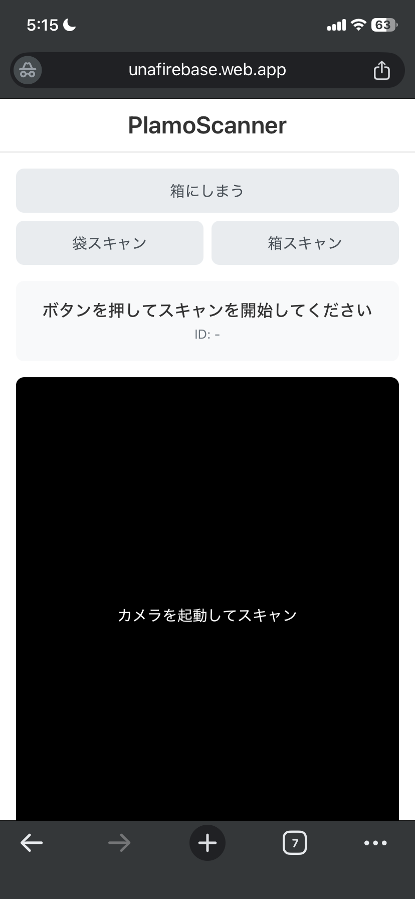

# PlamoScanner PWA

プラモデルの余剰パーツ管理システム「PlamoScanner」のPWA（Progressive Web App）版です。
iOS/Androidなどのスマートフォンブラウザで動作し、QRコードのスキャンとNotionデータベースとの連携機能を提供します。

## 使い方

1. RQシールを印刷する。[PlamoScanner](https://github.com/unafi/PlamoScanner)のQRprint参照。
2. シールを袋（仕舞うもの）と箱（仕舞う場所）に貼る。
3. アプリ動かして「箱にしまう」ボタン押す。カメラが起動するので、箱→袋の順にQRコードをスキャンする。
4. Notionにレコード追加され、箱のレコードが開く（Notionアプリ導入済みの前提）
5. Notionアプリで開いたデータを修正。箱の名前とか、袋に入れたモノの写真とか。

<kbd></kbd>

## 主な技術スタック

- **フロントエンド:** HTML, CSS, JavaScript (Vanilla JS)
- **バックエンド (API):** Google Apps Script (GAS)
- **ホスティング:** Firebase Hosting
- **データベース:** Notion

## 構築・デプロイ手順

このPWAを自分用にセットアップするための手順です。いくつかの事前準備を済ませておくとスムーズに進みます。

### ステップ0: 事前準備

`firebase init` 中のエラーを避けるため、以下の準備を先に行うことを強く推奨します。

**1. Firebase プロジェクトの作成**
- [Firebaseコンソール](https://console.firebase.google.com/)にアクセスし、「プロジェクトを追加」から新しいプロジェクトを先に作成しておきます。

**2. GitHub リポジトリの作成とコードのPush**
Firebaseの自動デプロイ機能（GitHub Actions）を利用するために、ソースコードを先にGitHubへpushしておきます。
- [GitHub](https://github.com/new)で新しいリポジトリを作成します。
- ローカルのプロジェクトディレクトリで、以下のコマンドを実行してコードをpushします。
  ```shell
  # Gitリポジトリとして初期化
  git init
  # ファイルをコミット
  git add .
  git commit -m "Initial commit"
  # リモートリポジトリを設定してpush（URLは自分のものに書き換える）
  git remote add origin <YOUR_GITHUB_REPOSITORY_URL>
  git push -u origin main
  ```
  > **Note:** `git push`時に `src refspec main does not match any` というエラーが出た場合、ローカルのブランチ名が `master` になっている可能性があります。`git branch`で名前を確認し、`git push -u origin master` を試すか、`git branch -M main`でブランチ名を変更してください。

### ステップ1: バックエンド (Google Apps Script) の設定

1. **Apps Scriptプロジェクト作成:** [Google Apps Script](https://script.google.com/home) で「新しいプロジェクト」を作成します。
2. **コードの貼り付け:** エディタに `Code.gs` の内容を貼り付け、プロジェクトを保存します。
3. **スクリプトプロパティの設定:**
   - 左メニューの「プロジェクトの設定」(歯車アイコン) を開きます。
   - 「スクリプト プロパティ」セクションで、以下の3つのキーと値を設定します。
     - `NOTION_API_KEY`: Notionインテグレーションキー
     - `DATABASE_ID_HUKURO`: 袋マスターDBのID
     - `DATABASE_ID_HAKO`: 箱マスターDBのID
4. **ウェブアプリとしてデプロイ:**
   - 右上の「デプロイ」>「新しいデプロイ」を選択します。
   - 種類として「ウェブアプリ」を選び、「アクセスできるユーザー」を**「全員」**に設定してデプロイします。
   - 表示された**ウェブアプリのURL**をコピーします。

### ステップ2: フロントエンドの設定

1. プロジェクト内の `app.js` ファイルを開きます。
2. `const GAS_WEB_APP_URL = 'REPLACE_ME_GAS_URL';` の部分を書き換えるために、githubAction用のシークレットを追加し、ステップ1でコピーしたウェブアプリのURLをセットします。
シークレット設定はgithubのSettings > Secrets and variables > Actions > New repository secretから設定できます。
　→　シークレット名は`GAS_WEB_APP_URL`とする。（.github/workflows/firebase-hosting-merge.ymlの置換処理sedの第4引数を参照）

3. 変更を保存し、再度GitHubにpushしておきます。
   ```shell
   git add app.js
   git commit -m "Configure GAS URL"
   git push
   ```

### ステップ3: Firebase Hosting へのデプロイ

1. **Firebase Toolsのインストール (初回のみ):**
   ```shell
   npm install -g firebase-tools
   ```
2. **Firebaseへのログイン (初回のみ):**
   ```shell
   firebase login
   ```
3. **プロジェクトの初期化:**
   ```shell
   firebase init hosting
   ```
   - `Please select an option:` -> `Use an existing project` を選択し、事前準備で作成したFirebaseプロジェクトを選びます。
   - `What do you want to use as your public directory?` -> `.` を入力します。
   - `Configure as a single-page app?` -> `Yes` を選択します。
   - `Set up automatic builds and deploys with GitHub?` -> `Yes` を選択し、指示に従ってGitHubアカウントと連携し、リポジトリ名 (`user/repo`形式) を入力します。
   > **Note:** `Service account ... does not exist` エラーが出た場合、対象プロジェクトの **IAM API** を有効にする必要があります。[こちらのリンク](https://console.cloud.google.com/apis/library/iam.googleapis.com) などからプロジェクトを選択して「有効にする」ボタンを押してから `firebase init hosting` を再試行してください。

4. **手動デプロイ (初回):**
   ```shell
   firebase deploy
   ```
   以降は、GitHubのmainブランチにpushするたびに自動でデプロイが実行されます。
   ２回目以降はgithubActionsで自動デプロイされます。（.github/workflows/firebase-hosting-merge.yml参照）
   自動デプロイのためにSecretにGAS_WEB_APP_URLとFIREBASE_SERVICE_ACCOUNT_UNAFIREBASEを設定する必要があります。（Settings > Secrets and variables > Actions > New repository secret）   
