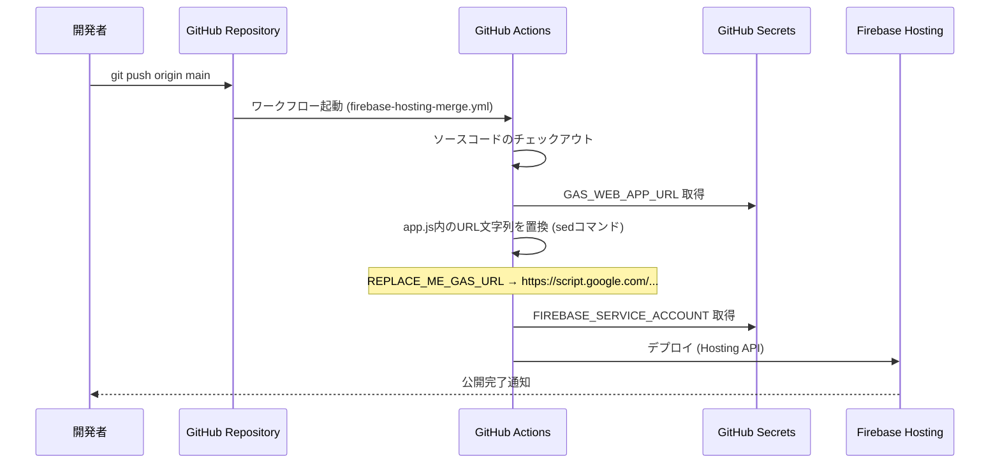
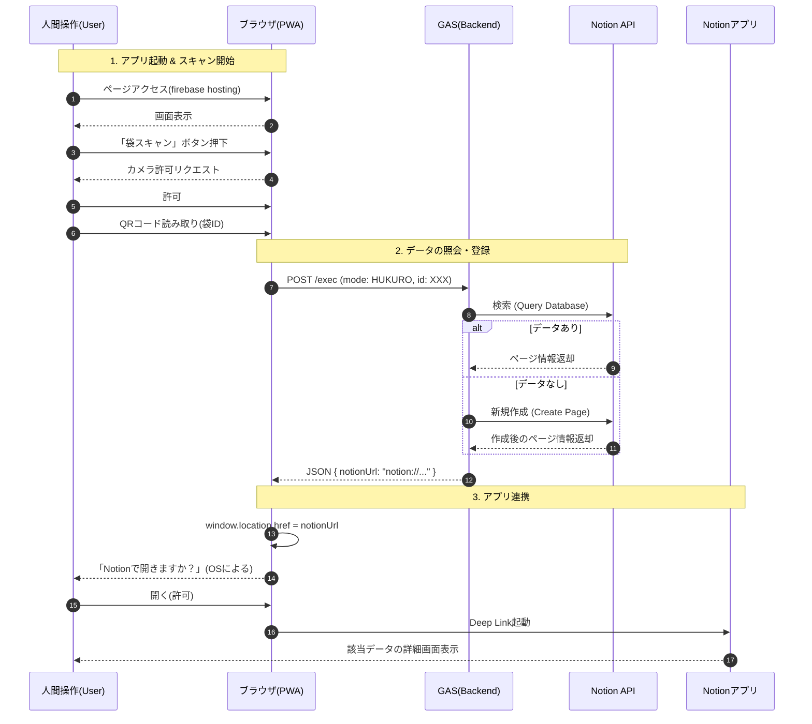
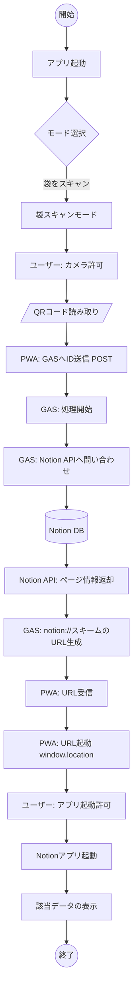

# PlamoScannerPWA 技術仕様書

## 1. システム概要

本システムは、プラスチックモデルの「袋」と「箱」をQRコードで管理し、Notionデータベースと連携させるPWA（Progressive Web App）です。
ユーザーはスマホのカメラでQRコードをスキャンするだけで、該当するNotionページを開いたり、袋を箱に「しまう（紐付ける）」処理を行うことができます。

### アーキテクチャ図

```mermaid
graph TD
    User[ユーザー] -->|アクセス| PWA[Firebase Hosting (PWA)]
    User -->|1. カメラ許可 & スキャン| PWA
    PWA -->|2. QRコード読取 (ID)| PWA_JS[app.js]
    PWA_JS -->|3. POST (ID, Mode)| GAS[Google Apps Script]
    
    subgraph "Backend Logic (GAS)"
        GAS -->|4. API Call| NotionAPI[Notion API]
        NotionAPI -->|5. SELECT / INSERT / UPDATE| NotionDB[(Notion Database)]
        NotionDB -->|6. 結果返却 (Page URL / ID)| NotionAPI
        NotionAPI -->|7. JSON| GAS
    end
    
    GAS -->|8. Response (notion:// URL)| PWA_JS
    PWA_JS -->|9. Redirect| NotionApp[Notionアプリ]
    NotionApp -->|10. 該当ページ表示| User
```

## 2. デプロイメントフロー

GitHubの `main` ブランチへのプッシュをトリガーとして、GitHub Actionsが自動的にFirebase Hostingへデプロイを行います。

### デプロイの流れ



### 必要なAPI認可設定

デプロイを自動化するために、以下のGoogle Cloud APIが有効化されています（`firebase init` 時に設定）。

| API名 | 用途 |
| :--- | :--- |
| **Firebase Hosting API** | GitHub Actionsから静的ファイル（html, js, css等）をアップロード・公開するために使用。 |
| **Cloud Resource Manager API** | デプロイ用のサービスアカウントの権限管理を自動化するために初期設定時に使用。 |
| **Firebase Management API** | Firebaseプロジェクトの構成情報の取得・管理に使用。 |

## 3. アプリケーションロジック詳細

### 3.1. フロントエンド (app.js)

ユーザーインターフェースとQRスキャンを担当します。
操作モード (`currentMode`) に基づき、スキャン後の挙動を決定します。

*   **ライブラリ**: `html5-qrcode` を使用してブラウザ上でQRコードを解析。
*   **通信**: `fetch` APIを使用し、GASのWebアプリURLに対してPOSTリクエストを送信。
    *   セキュリティのため、GASのURLはソースコードに直接記述せず、GitHub Secrets (`GAS_WEB_APP_URL`) からデプロイ時に埋め込んでいます。
*   **アプリ連携**: レスポンスに `notionUrl` が含まれる場合、`window.location.href` にセットしてNotionアプリを起動します。

### 3.2. バックエンド (GAS: Code.gs)

Notion APIとの通信仲介ロジックを担当します。

#### クライアントからのリクエスト
```json
{
  "mode": "HUKURO_SCAN", // 動作モード
  "id": "QR_CODE_DATA",  // スキャンされたID
  "hakoPageId": "..."    // (任意) 紐付け先の箱PageID
}
```

#### 処理ロジック
1.  **袋スキャン / 箱スキャン (`processHukuro`, `processHako`)**
    *   指定されたIDでNotionデータベースを検索 (`query`)。
    *   存在すればそのページ情報を取得。
    *   存在しなければ新規ページを作成 (`create`)。
    *   ページのURL (`https://...`) を `notion://...` に変換して返却。

2.  **しまう処理 (Step 1 & 2)**
    *   **Step 1**: 箱をスキャン。箱ページを特定し、その `pageId` と名前をフロントエンドに一時保存させる。
    *   **Step 2**: 袋をスキャン。Step 1の箱 `pageId` を受け取り、袋ページのプロパティ「現在の箱」を更新 (`patch`) して箱と紐付ける。
    *   完了後、箱のページを開くURLを返却。

## 4. ユーザー操作フロー (User usage flow)

### 4.1. 処理シーケンス (Sequence Diagram)

ユーザーが袋をスキャンし、最終的にNotionアプリでその詳細画面を開くまでのシーケンスです。



### 4.2. システム内部フロー (参考)

アプリ内部での具体的な処理分岐（袋スキャンの例）です。



## 5. 環境設定・シークレット

### GitHub Secrets (Actions用)
| シークレット名 | 内容 |
| :--- | :--- |
| `GAS_WEB_APP_URL` | デプロイされたGASウェブアプリのURL。`app.js` への埋め込みに使用。 |
| `FIREBASE_SERVICE_ACCOUNT_...` | Firebaseへのデプロイ権限を持つサービスアカウントキー。 |

### GAS Script Properties (バックエンド用)
GASの「プロジェクトの設定」>「スクリプトプロパティ」で設定します。

| プロパティ名 | 内容 |
| :--- | :--- |
| `NOTION_API_KEY` | Notion Integration Token (secret_...) |
| `DATABASE_ID_HUKURO` | 袋データベースのID (32文字) |
| `DATABASE_ID_HAKO` | 箱データベースのID (32文字) |

---
*Document generated by Antigravity Assistant*
